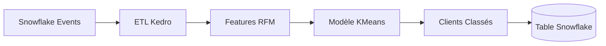

# 📊 Segmentation Clients avec Kedro & Snowflake

[](https://kedro.org)  
[](https://www.snowflake.com/)  
[](https://www.docker.com/)  

---

## 📝 Aperçu du projet

Ce projet met en place un **prototype de solution d’IA** permettant de :  
- Préparer et transformer les données d’événements clients (**ETL Kedro**)  
- Construire des indicateurs **RFM enrichis** (Recency, Frequency, Monetary + comportements)  
- Appliquer un modèle de **clustering KMeans** pour classer les clients selon leur profil  
- Stocker les résultats (clients classés) dans **Snowflake** via **Snowpark**  
- Fournir une pipeline prête à être packagée dans **Docker** pour un déploiement en production  

---

## ⚙️ Architecture du projet

Flux de traitement :  

**Événements clients → ETL Kedro → Préparation RFM → Modèle KMeans → Résultats dans Snowflake**

Les pipelines sont organisés en *nodes* modulaires :  

- `prepare_rfm_node` → Préparation des features  
- `train_model_node` → Entraînement et évaluation (inertia, silhouette)  
- `predict_new_clients_node` → Classification des nouveaux clients  
- `store_results_node` → Sauvegarde des résultats dans Snowflake  

Exemple d’architecture (Mermaid) :  



---

## 🚀 Installation

Cloner le projet et installer les dépendances :  

```bash
git clone <url-du-repo>
cd mspr2
pip install -r requirements.txt
```

Configurer vos accès **Snowflake** dans `conf/local/credentials.yml`  

export SNOWFLAKE_USER=xxx
export SNOWFLAKE_PASSWORD=xxx
export SNOWFLAKE_ACCOUNT=xxx
export SNOWFLAKE_WAREHOUSE=xxx
export SNOWFLAKE_DATABASE=AMAZING_DB
export SNOWFLAKE_SCHEMA=SCHEMAS


⚠️ Ne jamais commiter vos credentials dans le repository.

---

## ▶️ Exécution des pipelines

Lancer l’ETL et le pipeline de classification :  

```bash
kedro run
```

Exemple pour lancer uniquement la prédiction de nouveaux clients :  

```bash
kedro run --pipeline prediction
```

---


## 🐳 Déploiement avec Docker

Une image Docker est disponible pour exécuter le pipeline dans un environnement isolé.  

Construire l’image :  
```bash
docker build -t mspr2:latest .
```

Lancer le conteneur sur le cloud :  
```bash
docker run --rm -it \
  -e SNOWFLAKE_USER=xxx \
  -e SNOWFLAKE_PASSWORD=xxx \
  -e SNOWFLAKE_ACCOUNT=xxx \
  -e SNOWFLAKE_WAREHOUSE=xxx \
  -e SNOWFLAKE_DATABASE=AMAZING_DB \
  -e SNOWFLAKE_SCHEMA=SCHEMAS \
  mspr2-prediction:latest \
  kedro run --pipeline=prediction_pipeline

```

---

## 📂 Structure du projet

```
mspr2/
├── conf/                 # Configuration Kedro (credentials, catalogues, params…)
├── data/                 # Données locales (jamais commit)
├── src/mspr2/            # Code source Kedro (pipelines, nodes, hooks…)
├── tests/                # Tests unitaires
├── requirements.txt      # Dépendances Python
└── README.md             # Ce fichier
```

---

## 📊 Résultats attendus

- Segmentation automatique des clients en **clusters** basés sur leur comportement  
- Table Snowflake mise à jour contenant les clients classés  
- Pipelines modulaires pour s’intégrer facilement dans un environnement de production  

---

## 📚 Références

- [Documentation Kedro](https://docs.kedro.org)  
- [Snowflake Snowpark](https://docs.snowflake.com/en/developer-guide/snowpark/python/index)  
- [Scikit-Learn Clustering](https://scikit-learn.org/stable/modules/clustering.html)  

---
